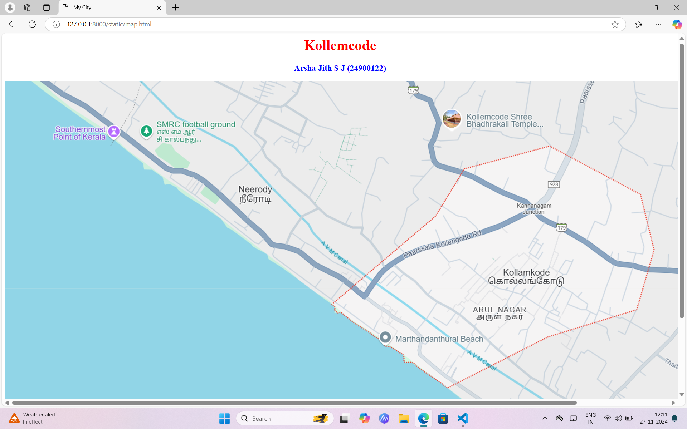
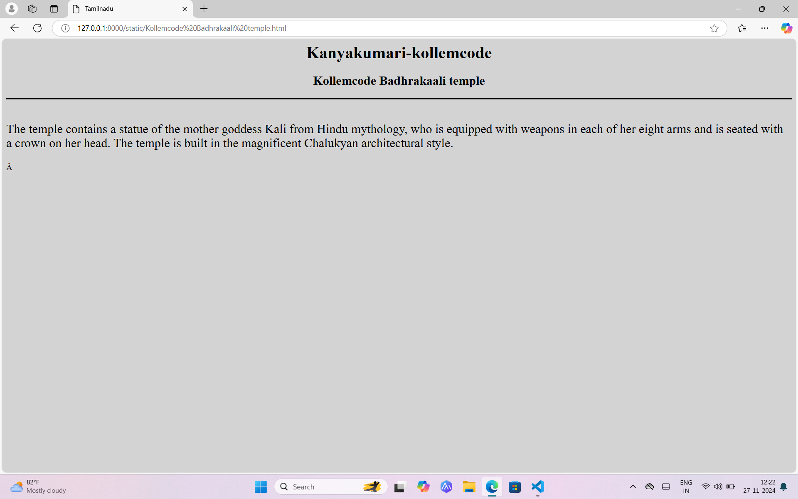
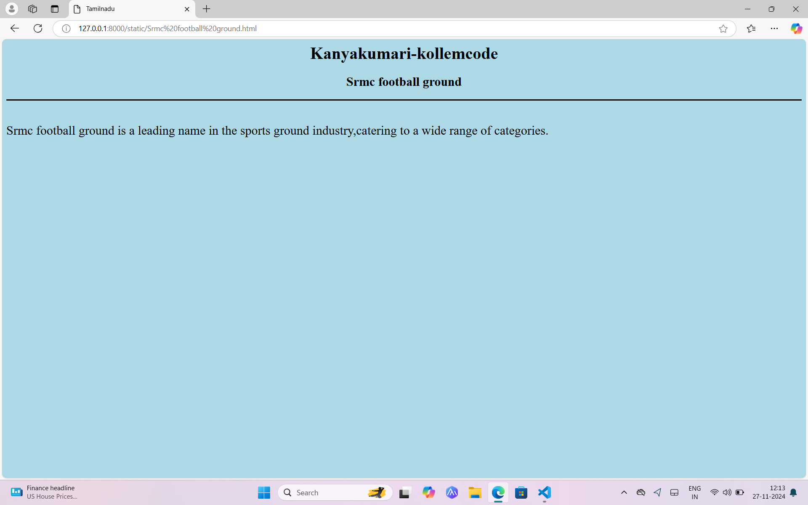
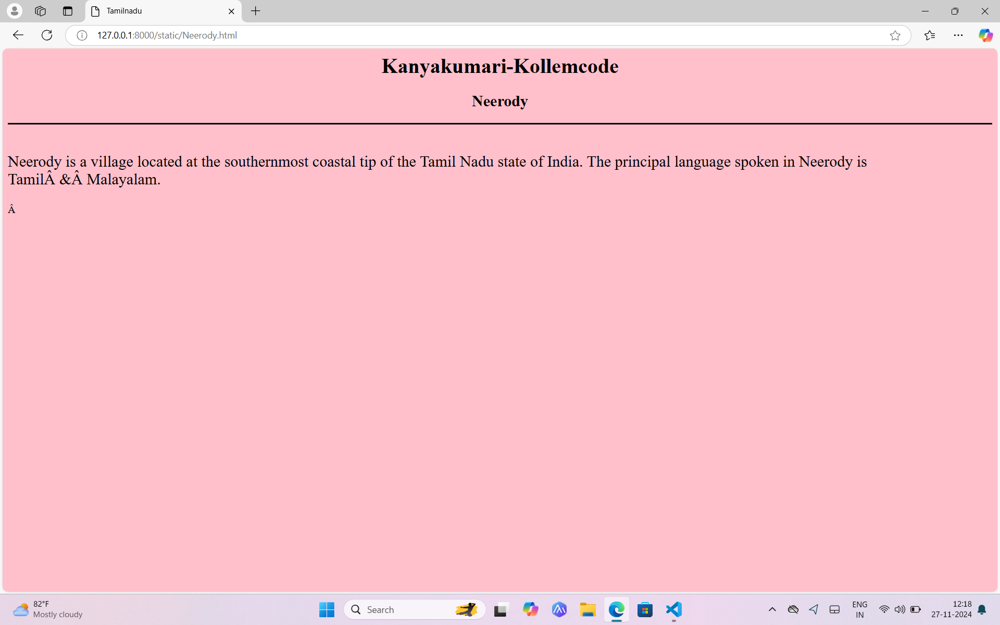
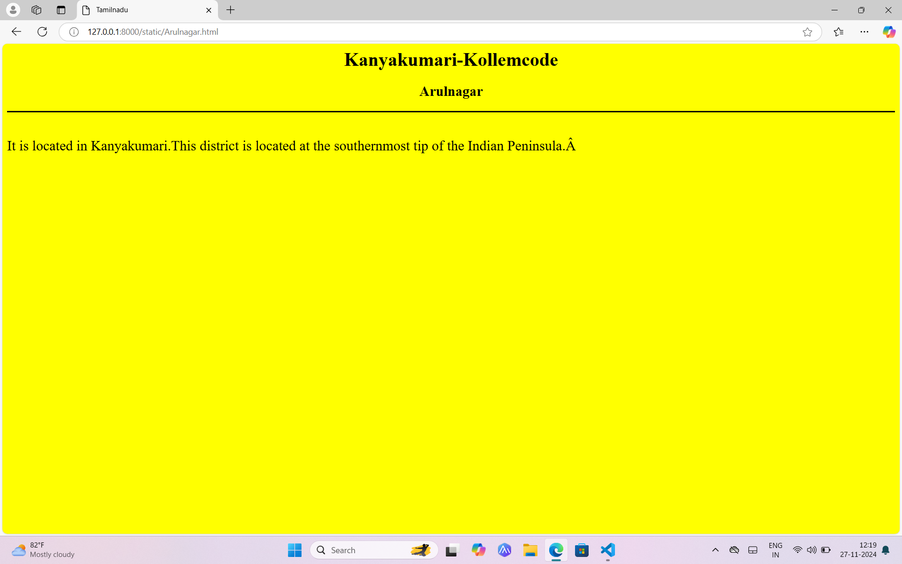
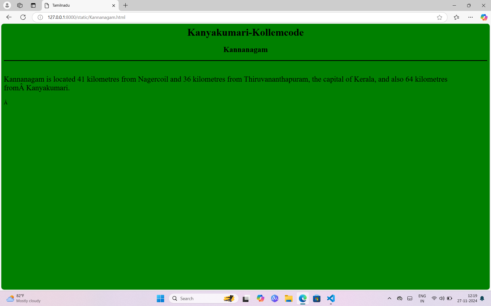

# Ex04 Places Around Me
## Date: 

## AIM
To develop a website to display details about the places around my house.

## DESIGN STEPS

### STEP 1
Create a Django admin interface.

### STEP 2
Download your city map from Google.

### STEP 3
Using ```<map>``` tag name the map.

### STEP 4
Create clickable regions in the image using ```<area>``` tag.

### STEP 5
Write HTML programs for all the regions identified.

### STEP 6
Execute the programs and publish them.

## CODE
```
<html>
    <head>
        <title>My City</title>
    </head>
    <body>
        <h1 align="center">
        <font color="red"><b>Kollemcode</b></font>
        </h1>
        <h3 align="center">
        <font color="blue"><b>Arsha Jith S J (24900122)</b></font>
        </h3>
        <center>
        
        <map name="image-map">
            <area target="" alt="Kollemcode Badhrakaali temple" title="Kollemcode Badhrakaali temple" href="Kollemcode Badhrakaali temple.html" coords="1094,90,55" shape="circle">
            <area target="" alt="Srmc football ground" title="Srmc football ground" href="Srmc football ground.html" coords="393,172,271,60" shape="rect">
            <area target="" alt="Neerody" title="Neerody" href="Neerody.html" coords="551,251,639,322" shape="rect">
            <area target="" alt="Arulnagar" title="Arulnagar" href="Arulnagar.html" coords="1063,512,47" shape="circle">
            <area target="" alt="Kannanagam" title="Kannanagam" href="Kannanagam.html" coords="1178,281,53" shape="circle">
        </map>
        </center>
        </body>
        </html>

Kollemcode Badhrakaali temple.html

<html>
    <head>
        <title>Tamilnadu</title>
    </head>
    <body bgcolor="Lightgrey">
        <font><h1 align="center">Kanyakumari-kollemcode</h1></font>
        <h2 align="center">Kollemcode Badhrakaali temple</h2>
        <hr size="3" color="black">
        <p align="justify"></p>
        <font align="center" size="5">
            <br>
    The temple contains a statue of the mother goddess Kali from Hindu mythology, who is equipped with weapons in each of her eight arms and is seated with a crown on her head. The temple is built in the magnificent Chalukyan architectural style.   
        </p></font>
        </body>
</html>

Srmc football ground.html

<html>
    <head>
        <title>Tamilnadu</title>
    </head>
    <body bgcolor="Lightblue">
        <font><h1 align="center">Kanyakumari-kollemcode</h1></font>
        <h2 align="center">Srmc football ground</h2>
        <hr size="3" color="black">
        <p align="justify"></p>
        <font align="center" size="5">
            <br>
        Srmc football ground is a leading name in the sports ground industry,catering to a wide range of categories.
        </p></font>
        </body>
</html>

Neerody.html

<html>
    <head>
        <title>Tamilnadu</title>
    </head>
    <body bgcolor="pink">
        <font><h1 align="center">Kanyakumari-Kollemcode</h1></font>
        <h2 align="center">Neerody</h2>
        <hr size="3" color="black">
        <p align="justify"></p>
        <font align="center" size="5">
            <br>
            Neerody is a village located at the southernmost coastal tip of the Tamil Nadu state of India. The principal language spoken in Neerody is Tamil & Malayalam.
        </p></font>
        </body>
</html>

Arulnagar.html

<html>
    <head>
        <title>Tamilnadu</title>
    </head>
    <body bgcolor="Yellow">
        <font><h1 align="center">Kanyakumari-Kollemcode</h1></font>
        <h2 align="center">Arulnagar</h2>
        <hr size="3" color="black">
        <p align="justify"></p>
        <font align="center" size="5">
            <br>
        It is located in Kanyakumari.This district is located at the southernmost tip of the Indian Peninsula. 
            </p></font>
            </body>
</html>

Kannanagam.html

<html>
    <head>
        <title>Tamilnadu</title>
    </head>
    <body bgcolor="Green">
        <font><h1 align="center">Kanyakumari-Kollemcode</h1></font>
        <h2 align="center">Kannanagam</h2>
        <hr size="3" color="black">
        <p align="justify"></p>
        <font align="center" size="5">
            <br>
        Kannanagam is located 41 kilometres from Nagercoil and 36 kilometres from Thiruvananthapuram, the capital of Kerala, and also 64 kilometres from Kanyakumari.
            </p></font>
    </body>
</html>

## OUTPUT









## RESULT
The program for implementing image maps using HTML is executed successfully.
